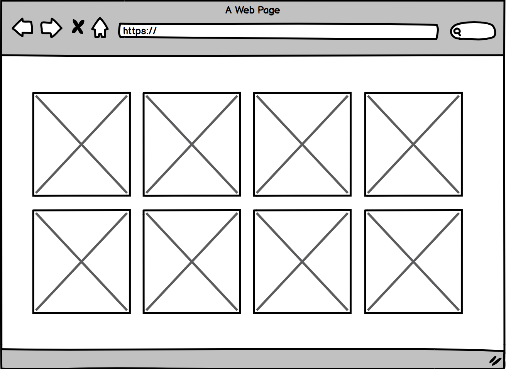
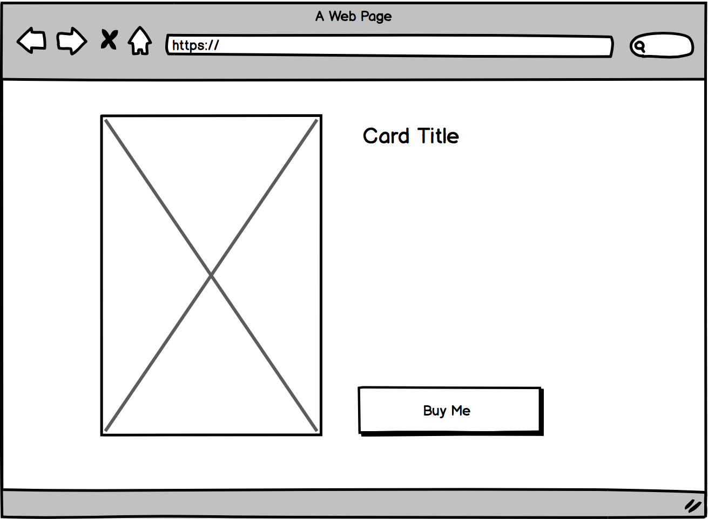

# Frontend Technical Challenge

## Brief

We've been asked to rebuild the moonpig website using the latest best practices and you are part of a team working on the proof of concept, we'd like you to build out a simple page which will display a list of cards that a customer can buy using our API.

It should meet the following use cases

> As a customer I can view a list of availble cards on my mobile, tablet and desktop so that I can celebrate my new job

> As a customer I can view a more details of a card so that I can decide it's the right card for me before purchase

## Wireframes

The following wireframes show a high-level representation of the content and user flow - we encourage you to go above and beyond what is presented, demonstrating your UX/UI as well as coding skills:

### Main Page


### Card Detail Page



## API

```
curl "https://search.moonpig.com/api/products?size=12&searchFacets=occasion_level_3:occasion%3Ewell%20done%3Enew%20job"
```

## Tools, libraries and frameworks

The choice of tools, libraries and frameworks used to develop the application is left open but you may want to consider using a front-end framework or library to help achieve this task (e.g. React) and a simple build process (e.g. Webpack).

It should be possible to statically host the application i.e. develop a single-page application and consider publishing to GitHub Pages or AWS S3.

The application will be tested on an up-to-date version of Chrome, but it should be compatible with most modern browsers: IE11+, Chrome, Firefox and Safari.

## Assessment
We will assess the task based on the following criteria:

- How clean, modular and extensible the code is.
Suitability of tools, libraries and frameworks used (for both the app itself and any build processes involved).
- How it looks visually and the techniques used to style the application.
- Responsive web design techniques used and the approach used for layout and accessibility.
- Testing.
- Anything above and beyond e.g. pagination, animation, routing, video playback etc.


We appreciate your free time is important. Therefore if you feel your unfinished code demonstrates enough for us to assess the application please leave some notes in your README.md explaining what you would do next given more time. We would be happy to review this.